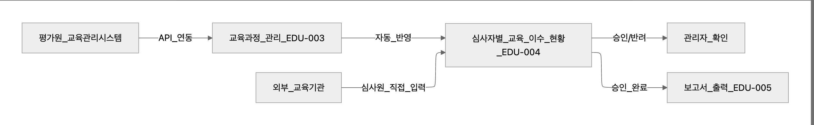
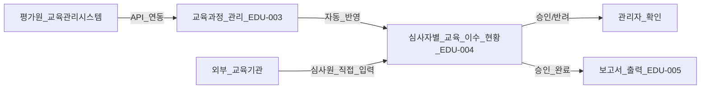

# 교육 실적 관리 시스템 수정 보고서

## 1. 지난주 피드백 요약

지난 회의에서 교육 실적 관리 화면에 대한 주요 피드백은 다음과 같았습니다.

| 구분             | 피드백 내용                                                                                                                    |
| -------------- | ------------------------------------------------------------------------------------------------------------------------- |
| **핵심 목적**      | 관리자가 교육 과정을 배정하는 것이 아니라, **심사원 개인이 외부에서 이수한 교육을 직접 등록**하고 이를 실적으로 인정받는 시스템으로 단순화                                          |
| **데이터 소스**     | ① **평가원 교육관리시스템**: 이미 존재하는 시스템과 연동하여 자동으로 이수 내역 가져오기 → 승인/반려 불필요 ② **안전원(외부 교육기관)**: 별도 시스템이 없으므로 **직접 등록 및 승인/반려 필요** |
| **메뉴 구조**      | 허가·심사 메뉴 하위에 **‘교육 실적 관리’** 메뉴 신설                                                                                         |
| **불필요 기능 제거**  | - ‘나의 교육 대상’ 화면 제거 - **필수 교육 이수율 계산 기능 제거**                                                                            |
| **보고서 목적 명확화** | 개인별, 부서별로 현재까지 **이수한 교육 및 인정 시간**을 한눈에 볼 수 있는 보고서 필요                                                                      |

---

## 2. 최종 확정된 시스템 구조

### 2.1 주요 화면

| 화면 ID   | 화면명               | 주요 기능                                                                        |
| ------- | ----------------- | ---------------------------------------------------------------------------- |
| EDU-003 | **교육과정 관리**       | - 평가원 교육관리시스템(API)과 동기화 - 안전원 등 외부 교육기관에서 직접 등록 가능 - 등록된 교육과정 목록 관리    |
| EDU-004 | **심사자별 교육 이수 현황** | - 심사원이 직접 외부 교육 등록 - 승인/반려 처리(외부 교육기관만 해당) - API 연동 내역은 승인 절차 없이 자동 반영 |
| EDU-005 | **교육 실적 보고서**     | - 개인별/부서별 보고서 생성 - 엑셀 다운로드 및 인쇄 기능                                        |

---

## 3. 변경 내용 상세

### 3.1 교육과정 관리 (EDU-003)

**변경 전**

* 모든 교육 과정이 관리자 등록 방식으로 관리됨.

**변경 후**

* 평가원 교육관리시스템과 **API 연동**으로 자동 가져오기 기능 추가.
* 외부 교육기관은 직접 교육 등록 가능.
* `데이터 소스` 항목으로 **API/EXTERNAL** 구분 표시.
* 검색 시 필수 여부, 교육기간, 데이터 소스 등 다양한 조건 필터 지원.
* 신규 등록 시 승인 절차가 필요한 외부 교육기관 데이터만 관리자가 확인.

> 효과:
>
> * 자동 연동으로 중복 입력 방지
> * 평가원 데이터는 그대로 반영되어 승인 과정 생략

---

### 3.2 심사자별 교육 이수 현황 (EDU-004)

**변경 전**

* 심사원의 개별 교육 등록 기능이 없고, 모든 등록을 관리자가 처리.

**변경 후**

* 심사원이 직접 본인의 **외부 교육 이수 내역 등록 가능**.
* 외부 교육기관 등록 건에 한해 승인/반려 기능 제공.
* API 연동으로 가져온 교육 내역은 **자동 승인 상태**로 표시.
* 등록 내역에는 수료증 파일 첨부 및 메모 기능 포함.

| 구분                | 처리 방식                |
| ----------------- | -------------------- |
| 평가원 교육관리시스템 데이터   | 자동 연동 → 승인 불필요       |
| 안전원 등 외부 교육기관 데이터 | 심사원 직접 등록 → 승인/반려 필요 |

> 개선 포인트:
>
> * 승인대기 상태는 리스트에서 시각적으로 강조
> * 행 클릭 시 팝업으로 상세 이수 내역 및 첨부파일 확인 가능

---

### 3.3 교육 실적 현황 보고서 (EDU-005)

**변경 전**

* 단순 목록 출력만 가능, 통계 및 보고서 기능 미흡.

**변경 후**

* **보고서 유형 선택**: 개인별 / 부서별 전환 가능
* 조회기간 및 부서, 심사자 필터 제공
* 엑셀 다운로드 및 인쇄 기능 강화
* 출력 항목: 부서, 성명, 교육과정, 이수일자, 인정시간, 상태, 데이터 소스

> 활용 예시:
>
> * 특정 부서의 월간 교육 실적 보고서 제출
> * 심사원 개인의 연간 교육 이수 내역 증빙

---

## 4. 시스템 데이터 흐름

---

## 5. 기대 효과

| 구분            | 기대 효과                          |
| ------------- | ------------------------------ |
| **자동 연동**     | 평가원 교육관리시스템 데이터 자동 반영으로 관리 효율화 |
| **승인 절차 단순화** | 외부 교육기관 데이터만 승인/반려 필요          |
| **개인 주도 등록**  | 심사원이 스스로 교육 내역 등록, 책임성 강화      |
| **행정 편의성**    | 실적 보고서 엑셀 출력 및 인쇄 지원           |
| **중복 업무 방지**  | 두 시스템 간 연동으로 데이터 이중 입력 최소화     |
